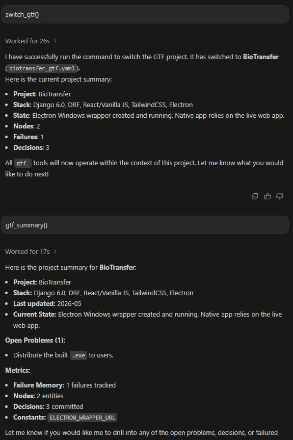

# Mnemo

> **Give Claude Permanent Memory**

Mnemo compresses your entire Claude.ai conversation history into a structured YAML memory file.
Upload it once to a new chat — Claude instantly has full project context, past decisions, and a
**Failure Memory** that auto-warns before repeating past mistakes.


---

## The Problem

Every time you hit Claude's context limit, you lose everything:
- Decisions already made
- Bugs already fixed
- Approaches already rejected
- Hours of hard-earned context

**Mnemo solves this in 3 commands.**

---

## Quick Start

```bash
# 1. Clone and install
git clone https://github.com/bharat18/mnemo
cd mnemo
pip install -r requirements.txt

# 2. Add to Claude Code (works in ALL projects)
claude mcp add --scope user chat-gtf -- python /path/to/mnemo/mcp_server.py

# 3. Restart Claude Code — Mnemo tools are now active
#    Say "shifting to new chat" → session auto-captured
#    In new session type: switch_gtf() → full context restored
```

**Real benchmark:** 484,000-char BioPrism project chat → 11,000-char YAML
- 97.6% token reduction · 41× smaller · 9 failure patterns captured

📖 **[See full step-by-step guide with screenshots →](docs/how-it-works.md)**

---

## See It In Action

**Step 1 — Say "shifting to new chat" → session auto-captured:**


**Step 2 — Type `switch_gtf()` → project picker opens:**


**Step 3 — Full context restored instantly:**


**Step 4 — Claude remembers everything — no re-explaining:**


---

## Works With

Mnemo is a standard MCP server — one install, works everywhere:

| Platform | Status |
|----------|--------|
| **Claude Code** | ✅ Native |
| **Claude Desktop** | ✅ |
| **Cursor** | ✅ |
| **Windsurf** | ✅ |
| **Google Antigravity** | ✅ |

**Mnemo running live in Google Antigravity:**



---

## The 5 Layers

| Layer | What it stores |
|-------|----------------|
| **Exon** | Committed decisions, pinned constants, rejected approaches, current state |
| **Nodes** | Every component/entity with type, connections, file locations |
| **Diffs** | What changed, from what version, and why |
| **Failure Memory** | Past bugs with trigger words — Claude warns before you repeat |
| **Dependency Web** | Blast radius per component (HIGH / MEDIUM / LOW) |

---

## Failure Memory — The Killer Feature

No other tool has this. Every captured failure includes **trigger words**.
When you mention one in a new chat, Claude intercepts automatically:

```
You: "should I use QToolButton for the dropdown?"

Claude: ⚠️ FAILURE MEMORY TRIGGERED — F003
  What failed  : QToolButton for dropdown menus
  Error        : Menu disappears when mouse leaves button area
  Time lost    : 2 hours
  Safe pattern : QPushButton + menu.exec() instead

Shall I proceed with the safe pattern?
```

---

## Usage

```bash
# Fully automated (default)
python indexer.py my_chat.md --provider openai

# Enrich: auto-fill missing code patterns for each failure
python indexer.py my_chat.md --provider openai --enrich

# Hybrid: manually enter known failures, Claude fills the rest
python indexer.py my_chat.md --provider openai --hybrid

# Anthropic provider
python indexer.py my_chat.md --provider anthropic
```

---

## MCP Integration (Claude Code / Claude Desktop / Cursor / Windsurf)

```bash
# Claude Code — user scope (all projects)
claude mcp add --scope user chat-gtf -- python /path/to/mnemo/mcp_server.py

# Claude Desktop — add to claude_desktop_config.json
# Cursor / Windsurf — add to mcp_config.json
# Google Antigravity — add to ~/.gemini/config/mcp_config.json
```

```json
{
  "mcpServers": {
    "chat-gtf": {
      "command": "python",
      "args": ["/path/to/mnemo/mcp_server.py"]
    }
  }
}
```

Full setup guide: [docs/mcp-setup.md](docs/mcp-setup.md)

---

## MCP Tools (20 total)

| Tool | What it does |
|------|-------------|
| `gtf_capture_session` | Capture current session → GTF YAML (no API key needed) |
| `gtf_checkpoint` | Save delta checkpoint mid-session |
| `gtf_prepare` / `gtf_save` | 2-step manual capture flow |
| `gtf_switch` | Switch active project (GUI picker or text menu) |
| `gtf_mount` | Mount project folder — access files directly |
| `gtf_set_root` | Link GTF to its project folder |
| `gtf_check_failures` | Checks trigger words before every response |
| `gtf_get_summary` | Full project overview for session start |
| `gtf_get_node` | Full context for any named component or entity |
| `gtf_get_decisions` | All committed decisions + rejected approaches |
| `gtf_get_blast_radius` | What breaks if component X changes |
| `gtf_get_open_problems` | Unresolved problems + current project state |
| `gtf_search` | Keyword search across all GTF layers |
| `gtf_add_failure` | Save a new failure to memory mid-session |
| `gtf_index` | Index a chat export file → GTF YAML |
| `gtf_status` | Health check — is YAML loaded and valid? |
| `gtf_list_projects` | List all available GTF projects |
| `watch_video` | Extract frames from YouTube/local video (vision) |
| `get_video_transcript` | Get YouTube transcript as timestamped text |

---

## Real-World Example

See [`examples/TestWebApp_gtf.yaml`](examples/TestWebApp_gtf.yaml) — a GTF from a React + FastAPI project.

Real benchmark from a BioPrism bioinformatics desktop app (484k-char chat):
- 16 committed decisions, 16 nodes with file locations
- 9 failure memories (F001–F009) with trigger words and safe patterns
- 8 component diffs with evolution history
- **Result: 484,000 chars → 11,000 chars (97.6% reduction)**

---

## Comparison

| Feature | Mnemo | Graphify | Graphiti/Zep | MemoryOS |
|---------|:-------:|:--------:|:------------:|:--------:|
| Works in Claude.ai UI | ✅ | ✅ | ❌ | ❌ |
| No server/API setup needed | ✅ | ✅ | ❌ | ❌ |
| Works on chat history | ✅ | ❌ code only | ⚠️ partial | ✅ |
| Failure Memory + trigger words | ✅ | ❌ | ❌ | ❌ |
| Offline / no cloud dependency | ✅ | ✅ | ❌ | ❌ |
| Portable YAML (attach anywhere) | ✅ | ❌ | ❌ | ❌ |
| Blast radius tracking | ✅ | ❌ | ❌ | ❌ |

---

## Project Structure

```
mnemo/
├── mcp_server.py        ← MCP server (20 tools) — the core of Mnemo
├── session_reader.py    ← Claude Code JSONL session reader
├── indexer.py           ← Chat export → GTF YAML pipeline
├── export_chat.js       ← Browser script to export Claude.ai chats
├── system_prompt.md     ← Paste into new Claude chat to activate memory
├── schema.yaml          ← Annotated YAML schema reference
├── requirements.txt
├── examples/
│   ├── TestWebApp_gtf.yaml   ← Sample GTF (React + FastAPI project)
│   └── sample_gtf.yaml       ← Minimal GTF example
├── docs/
│   ├── how-it-works.md       ← Step-by-step guide with screenshots
│   ├── mcp-setup.md          ← MCP setup for all platforms
│   └── architecture.md       ← Technical deep-dive
└── marketing/
    └── index.html            ← Landing page
```

---

## Requirements

- Python 3.10+
- `pyyaml`, `colorama`
- `openai` or `anthropic` (one API key, one-time indexing only)
- `mcp` (only for Claude Desktop integration)

```bash
pip install -r requirements.txt
```

---

## Contributing

Contributions welcome! See [CONTRIBUTING.md](CONTRIBUTING.md).

Ideas especially wanted:
- GTF templates for popular stacks (Next.js, FastAPI, ML experiments)
- Auto-export hook for Claude Desktop
- VS Code extension for inline GTF queries

---

## License

MIT — see [LICENSE](LICENSE)

---

*Inspired by GTF (Gene Transfer Format) annotation files in bioinformatics —
structured semantic layers on top of raw sequence data.*
