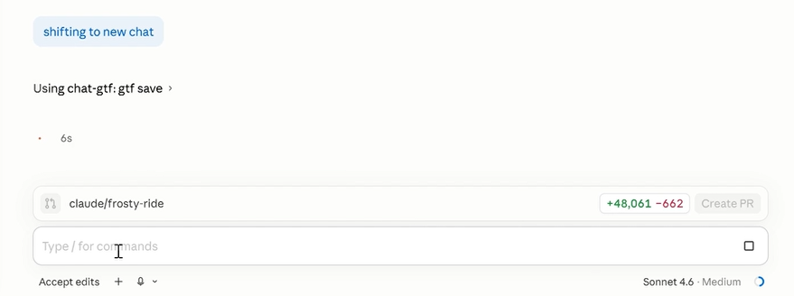
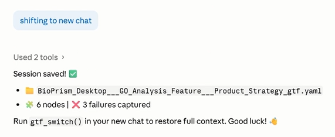
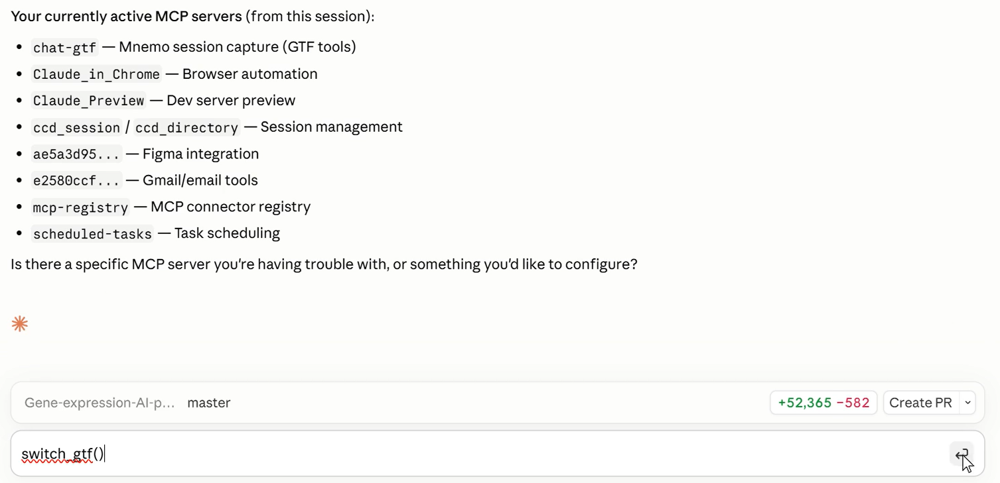
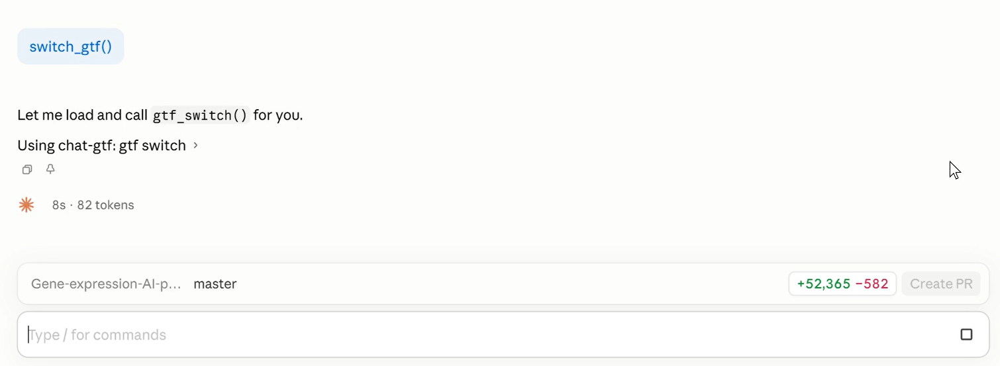
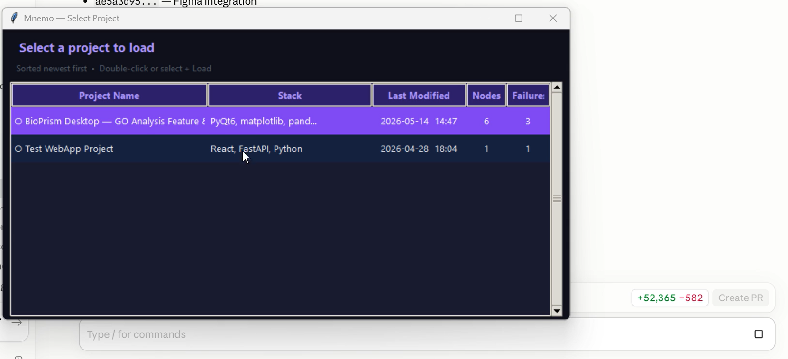
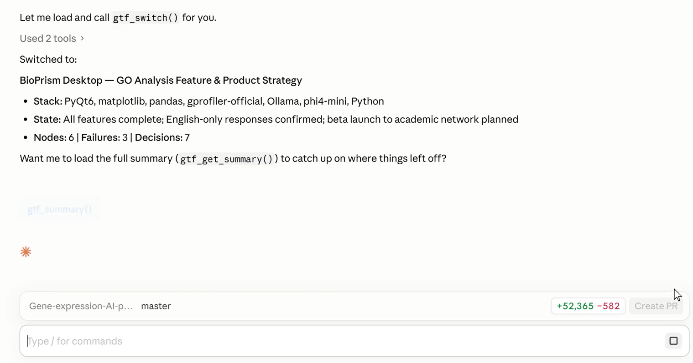
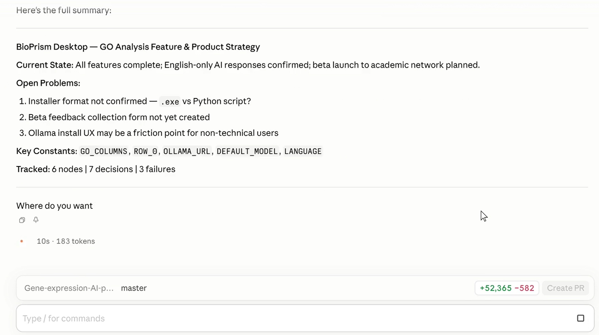
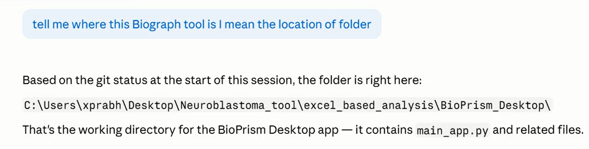

# How Mnemo Works — Step by Step

> Mnemo gives Claude Code **permanent memory** across sessions.  
> No API key needed. No re-explaining. Just pick up where you left off.

---

## The Problem

Every time you start a new Claude Code session, Claude forgets everything:
- What decisions you made
- What bugs you already fixed
- What approaches you already rejected
- Hours of hard-earned context — gone

**Mnemo solves this in 2 commands.**

---

## The Workflow

```
End of session          →    "shifting to new chat"   →   GTF saved ✅
New session starts      →    switch_gtf()             →   Full context restored ✅
Ask anything            →    Claude already knows     →   No re-explaining ✅
```

---

## Step 1 — Save Your Session

When you're done working, just say **"shifting to new chat"** in the chat.

Mnemo automatically triggers `gtf_save` — no command needed.



Claude captures the session and saves it as a structured YAML file:



**What gets saved:**
- ✅ All key decisions made this session
- ✅ Components and their current state
- ✅ Failures and what to avoid next time
- ✅ Open problems and next steps

> *In the screenshot above: 6 nodes and 3 failures captured from a real BioPrism project session.*

---

## Step 2 — Start a New Session

Open a fresh Claude Code session. Mnemo's MCP tools are automatically active:



Type **`switch_gtf()`** in the chat:



---

## Step 3 — Pick Your Project

A project picker window opens — all your past projects, sorted newest first:



**Double-click** any project to load it instantly.

> Each row shows: Project name · Tech stack · Last modified · Node count · Failure count

---

## Step 4 — Full Context Restored

Claude now has your complete project context:



And a full summary on demand:



**What Claude now knows without you saying anything:**
- Current project state
- Stack and dependencies
- Open problems
- Key constants (never change these)
- Past decisions (don't re-debate these)
- Failure memory (don't repeat these mistakes)

---

## Step 5 — Claude Remembers Everything

Ask anything about your project — Claude already knows:



No need to re-explain file locations, architecture decisions, or past bugs.

---

## Step 6 — Mount Your Project (Optional)

Use `mount_gtf` to instantly access all your project files:


Claude gets direct access to key files listed in your GTF — ready to read, edit, or debug.

---

## Summary

| Step | Command | What happens |
|------|---------|-------------|
| **Save** | *"shifting to new chat"* | Session captured → GTF YAML saved |
| **Switch** | `switch_gtf()` | Project picker opens |
| **Restore** | Double-click project | Full context loaded in seconds |
| **Recall** | Ask anything | Claude answers from memory |
| **Mount** | `mount_gtf` | Project files instantly accessible |

---

## Under the Hood

Mnemo stores memory in a **GTF YAML file** — 6 structured layers:

```yaml
meta:         # project name, stack, dates
exons:        # decisions, constants, open problems, rejected approaches
nodes:        # every component with type, state, file location
diffs:        # what changed, from what, and why
failure_memory: # what failed, trigger words, safe patterns
dependencies: # blast radius — what breaks if X changes
```

A 484,000-character BioPrism project chat compresses to an **11,000-character YAML** — 97.6% smaller.

---

## Installation

See [mcp-setup.md](mcp-setup.md) for full setup instructions.

**Quick start:**
```bash
git clone https://github.com/bharat18/mnemo
cd mnemo
pip install -r requirements.txt

# Add to Claude Code (user scope — works in all projects)
claude mcp add --scope user chat-gtf -- python /path/to/mnemo/mcp_server.py
```

Then restart Claude Code and type `switch_gtf()` to begin.
